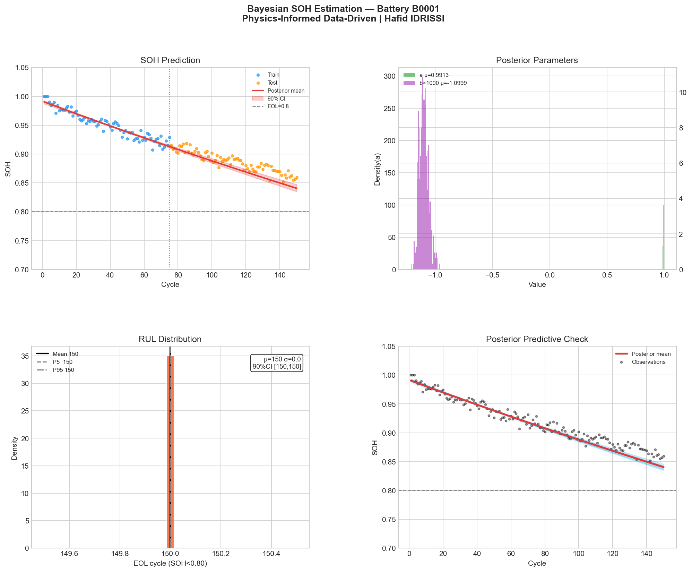
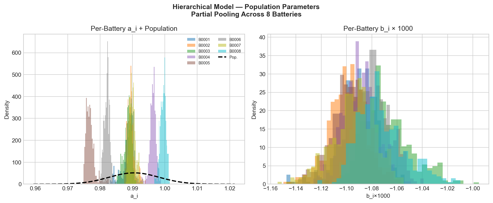

# Bayesian SOH Estimation for Li-ion Batteries

**Physics-Informed Data-Driven approach to Battery State-of-Health prediction**  
*Preparatory research work — CIFRE PhD candidate | Stellantis / CentraleSupélec*  
**Author: Hafid IDRISSI** · [LinkedIn](https://www.linkedin.com/in/hafid-idrissi/) · [ORCID: 0009-0000-4326-1487](https://orcid.org/0009-0000-4326-1487)

---

## Scientific Context

Battery State-of-Health (SOH) prediction is a critical challenge in automotive engineering. This project implements **Bayesian hierarchical inference** to estimate SOH degradation parameters and quantify uncertainty on Remaining Useful Life (RUL) predictions.

This work is directly motivated by the following references:

> [1] Zhou, Z. & Howey, D.A. (2023). *Bayesian hierarchical modelling for battery lifetime early prediction*. IFAC-PapersOnLine, 56(2), 6117–6123. https://doi.org/10.1016/j.ifacol.2023.10.708  
> [2] Vanem, E. et al. (2021). *Data-driven state of health modelling — A review*. Journal of Energy Storage, 43, 103158.

---

## Approach

### Degradation Model

Battery SOH follows an empirical exponential decay:

```
SOH(k) = a · exp(b · k) + ε,   ε ~ N(0, σ²)
```

where:
- `k` — cycle number  
- `a` — initial capacity parameter  
- `b` — degradation rate (negative)  
- `σ` — observation noise  

### Two Complementary Models

| Model | Description | Use case |
|---|---|---|
| **Single-battery** | Bayesian posterior on `a`, `b`, `σ` per unit | Individual RUL estimation |
| **Hierarchical** | Partial pooling across fleet of batteries | Population-level variability, fleet management |

### Bayesian Inference

Posterior sampling via **NUTS** (No-U-Turn Sampler) using [PyMC](https://www.pymc.io/):

```python
with pm.Model():
    a     = pm.Normal("a",     mu=1.0,    sigma=0.05)
    b     = pm.Normal("b",     mu=-0.001, sigma=0.001)
    sigma = pm.HalfNormal("sigma", sigma=0.02)
    mu    = a * pm.math.exp(b * k)
    obs   = pm.Normal("obs", mu=mu, sigma=sigma, observed=y)
    trace = pm.sample(1000, tune=500, target_accept=0.9)
```

---

## Results

### Single Battery (B0001) — Posterior Prediction


**Key outputs:**
- Posterior mean degradation rate: `b ≈ -0.00109 /cycle`
- RUL prediction with 90% credible interval
- Posterior predictive check validating model fit

### Hierarchical Model — Fleet Population


**Key outputs:**
- Population-level parameters: `μ_a ≈ 0.989`, `μ_b ≈ -0.00109`
- Per-battery parameter distributions showing unit-to-unit variability
- Partial pooling effect: individual estimates shrink toward population mean

---

## Project Structure

```
bayesian_soh_project/
├── data/
│   └── battery_degradation.csv      # Simulated NASA-style dataset (8 batteries, 150 cycles)
├── src/
│   ├── generate_data.py             # Data simulation (empirical double-exp model)
│   └── bayesian_soh.py              # Main Bayesian inference pipeline
├── results/
│   ├── bayesian_soh_B0001.png       # 4-panel results figure
│   └── hierarchical_population.png  # Fleet-level parameter distributions
├── requirements.txt
└── README.md
```

---

## Installation & Usage

```bash
git clone https://github.com/HafidIdrissi/bayesian-soh-batteries.git
cd bayesian-soh-batteries

pip install -r requirements.txt

# Generate dataset
python src/generate_data.py

# Run Bayesian inference (approx. 1 min)
python src/bayesian_soh.py
```

---

## Connection to PhD Thesis Topic

This project directly addresses the core objectives of the CIFRE thesis at **Stellantis / CentraleSupélec**:

| Thesis objective | This project |
|---|---|
| Benchmark Bayesian inference methodologies | NUTS sampler via PyMC, hierarchical vs. single model |
| Assess parameter distributions | Full posterior on `a`, `b`, `σ` per battery |
| Quantify uncertainty on RUL | 90% credible intervals on end-of-life cycle |
| Handle unit-to-unit variability | Hierarchical partial pooling across 8 batteries |
| Physics-informed modeling | Empirical degradation law as structural prior |

---

## Requirements

```
pymc>=5.0
numpy>=1.24
pandas>=2.0
matplotlib>=3.7
arviz>=0.16
scipy>=1.10
```

---

## Data Note

This repository uses **simulated data** inspired by the NASA PCoE Battery Dataset.  
Real dataset available at: https://www.nasa.gov/content/prognostics-center-of-excellence-data-set-repository  
(Batteries B0005, B0006, B0007, B0018 — Li-ion 18650 cells, 2Ah nominal capacity)
